# Database Schema v1.6 — English AI Coach

**Status:** APPROVED BASELINE  
**Đề tài:** Xây dựng ứng dụng học từ vựng tiếng Anh tích hợp AI cá nhân hóa lộ trình học  
**Database:** PostgreSQL  
**Backend:** Java Spring Boot + Spring Data JPA / Hibernate  
**Migration:** Flyway  
**Mobile V1:** Android Java  
**Mobile V2:** Flutter  
**Admin Web:** React + TypeScript + Vite  
**Backend API:** Java Spring Boot  

> **Trạng thái:** APPROVED BASELINE — đồng bộ với SRS v1.2, System Architecture v1.3, AI Personalization v1.3, API/OpenAPI v1.4 và Idempotency
> **Cập nhật:** 2026-08-31
> **Tổng số bảng:** 34

---

# 1. Mục tiêu thiết kế

Database phải hỗ trợ:

- Tài khoản USER/ADMIN.
- Local Login và Google OAuth.
- Access Token + Refresh Token.
- Refresh Token expiry/revoke.
- Brute-force login protection.
- User Profile và Onboarding.
- CEFR và lịch sử đánh giá trình độ.
- Vocabulary và Topic hierarchy.
- Vocabulary examples.
- Learning sessions và historical attempts.
- Adaptive Spaced Repetition.
- Weak Word Detection.
- Forgetting Risk.
- Vocabulary/Topic Recommendation.
- Difficulty Adjustment.
- Personalized Daily Plan.
- Quiz.
- Progress.
- Gamification.
- Notification.
- Reusable AI Content.
- Personalized/Ephemeral AI Content.
- AI request logging.
- AI usage/cost aggregation.
- AI budget control.
- Admin review/audit.
- Optimistic Locking cho các trạng thái có khả năng cập nhật đồng thời.
- Dữ liệu đủ để phát triển Machine Learning trong tương lai.
- Khả năng mở rộng sang Speaking/Writing/Listening/Reading.

---

# 2. Kiến trúc Database

```text
ACCOUNT & AUTH
├── users
├── refresh_tokens
├── user_profiles
├── goals
├── user_goals
├── cefr_levels
└── user_level_assessments

VOCABULARY
├── topics
├── vocabulary
├── vocabulary_topics
└── vocabulary_examples

LEARNING & PERSONALIZATION
├── user_vocabulary_progress
├── learning_sessions
├── session_attempts
└── daily_plans

QUIZ
├── quizzes
├── quiz_questions
├── quiz_attempts
└── quiz_attempt_answers

GAMIFICATION
├── streaks
├── xp_logs
├── badges
└── user_badges

NOTIFICATION
└── notifications

AI
├── ai_generated_content
├── ai_requests
└── ai_usage_daily

ADMIN
└── admin_audit_logs
```

---

# 3. Quy ước chung

## 3.1. Primary Key

Các bảng nghiệp vụ sử dụng:

```text
UUID
```

MVP có thể dùng UUIDv4. Có thể cân nhắc UUIDv7 khi cần identifier có tính time-ordered tốt hơn.

---

## 3.2. Timestamp

Sử dụng:

```text
TIMESTAMPTZ
```

cho các trường thời gian.

---

## 3.3. Enum

Các enum nghiệp vụ nên lưu dạng:

```text
VARCHAR
```

và map bằng:

```java
@Enumerated(EnumType.STRING)
```

---

## 3.4. Soft Delete

Các bảng nội dung/danh mục phù hợp nên dùng:

```text
is_active
```

thay vì xóa cứng:

```text
goals
topics
vocabulary
quizzes
badges
```

---

# 4. ACCOUNT & AUTHENTICATION

## 4.1. users

Bảng tài khoản chính.

| Column | Type | Constraint | Description |
|---|---|---|---|
| id | UUID | PK | User ID |
| email | VARCHAR(255) | UNIQUE, NOT NULL | Email |
| password_hash | VARCHAR(255) | NULL | Password hash; NULL nếu OAuth |
| auth_provider | VARCHAR(20) | NOT NULL | LOCAL / GOOGLE |
| provider_user_id | VARCHAR(255) | NULL | ID từ OAuth provider |
| full_name | VARCHAR(100) | NOT NULL | Họ tên |
| role | VARCHAR(20) | NOT NULL | USER / ADMIN |
| status | VARCHAR(20) | NOT NULL | ACTIVE / LOCKED |
| failed_login_attempts | INTEGER | NOT NULL, DEFAULT 0 | Số lần login sai liên tiếp |
| locked_until | TIMESTAMPTZ | NULL | Thời điểm hết khóa tạm |
| created_at | TIMESTAMPTZ | NOT NULL | Thời điểm tạo |
| updated_at | TIMESTAMPTZ | NOT NULL | Thời điểm cập nhật |
| last_login_at | TIMESTAMPTZ | NULL | Login gần nhất |

### Giá trị `auth_provider`

```text
LOCAL
GOOGLE
```

Có thể mở rộng:

```text
APPLE
FACEBOOK
```

### Default

```text
role = USER
status = ACTIVE
failed_login_attempts = 0
```

### OAuth uniqueness

```sql
CREATE UNIQUE INDEX uq_users_provider
ON users(auth_provider, provider_user_id)
WHERE provider_user_id IS NOT NULL;
```

### Index

```text
UNIQUE(email)
INDEX(auth_provider)
INDEX(status)
```

---

## 4.2. refresh_tokens

Lưu Refresh Token theo user/device/session.

| Column | Type | Constraint | Description |
|---|---|---|---|
| id | UUID | PK | Token record ID |
| user_id | UUID | FK → users.id, NOT NULL | User |
| token_hash | VARCHAR(255) | NOT NULL | Hash của refresh token |
| expires_at | TIMESTAMPTZ | NOT NULL | Thời điểm hết hạn |
| revoked_at | TIMESTAMPTZ | NULL | Thời điểm revoke |
| created_at | TIMESTAMPTZ | NOT NULL | Thời điểm tạo |
| last_used_at | TIMESTAMPTZ | NULL | Lần sử dụng gần nhất |
| device_info | VARCHAR(500) | NULL | Metadata thiết bị/phiên |

### Quy tắc

- Không lưu Refresh Token plaintext.
- Token hết hạn không được sử dụng.
- Token bị revoke không được sử dụng.
- Logout phải revoke token/session phù hợp.

### Index

```text
INDEX(user_id)
INDEX(expires_at)
INDEX(user_id, revoked_at)
INDEX(token_hash)
```

---

## 4.3. user_profiles

| Column | Type | Constraint |
|---|---|---|
| id | UUID | PK |
| user_id | UUID | FK, UNIQUE, NOT NULL |
| avatar_url | TEXT | NULL |
| current_cefr_level_id | UUID | FK, NULL |
| daily_learning_minutes | INTEGER | NOT NULL |
| timezone | VARCHAR(50) | NOT NULL |
| created_at | TIMESTAMPTZ | NOT NULL |
| updated_at | TIMESTAMPTZ | NOT NULL |

### Index

```text
UNIQUE(user_id)
INDEX(current_cefr_level_id)
```

---

# 5. GOALS

## 5.1. goals

| Column | Type | Constraint |
|---|---|---|
| id | UUID | PK |
| name | VARCHAR(100) | UNIQUE, NOT NULL |
| description | TEXT | NULL |
| is_active | BOOLEAN | NOT NULL |
| created_at | TIMESTAMPTZ | NOT NULL |

Ví dụ:

```text
GENERAL_ENGLISH
TRAVEL
BUSINESS
TOEIC
IELTS
COMMUNICATION
ACADEMIC
```

---

## 5.2. user_goals

Quan hệ N-N User ↔ Goal.

| Column | Type | Constraint |
|---|---|---|
| id | UUID | PK |
| user_id | UUID | FK, NOT NULL |
| goal_id | UUID | FK, NOT NULL |
| is_primary | BOOLEAN | NOT NULL |
| created_at | TIMESTAMPTZ | NOT NULL |

### Constraints

```text
UNIQUE(user_id, goal_id)
```

Tối đa một primary goal/user:

```sql
CREATE UNIQUE INDEX uq_user_goals_primary
ON user_goals(user_id)
WHERE is_primary = true;
```

### Index

```text
INDEX(goal_id)
```

---

## 5.3. goal_topics ⭐

Maps a learning goal to topics for deterministic V1 recommendation relevance.

| Column | Type | Constraint |
|---|---|---|
| id | UUID | PK |
| goal_id | UUID | FK, NOT NULL |
| topic_id | UUID | FK, NOT NULL |
| relevance_weight | DECIMAL(4,3) | NOT NULL |
| created_at | TIMESTAMPTZ | NOT NULL |

```text
UNIQUE(goal_id, topic_id)
CHECK(relevance_weight >= 0 AND relevance_weight <= 1)
```

---

# 6. CEFR & ASSESSMENT

## 6.1. cefr_levels

| Column | Type | Constraint |
|---|---|---|
| id | UUID | PK |
| code | VARCHAR(2) | UNIQUE, NOT NULL |
| name | VARCHAR(50) | NOT NULL |
| description | TEXT | NULL |
| sort_order | INTEGER | NOT NULL |

Dữ liệu:

```text
A1
A2
B1
B2
C1
C2
```

---

## 6.2. user_level_assessments ⭐

Persisted assessment aggregate/state for INITIAL, PERIODIC, or MANUAL placement assessments.

| Column | Type | Constraint |
|---|---|---|
| id | UUID | PK |
| user_id | UUID | FK, NOT NULL |
| assessment_type | VARCHAR(30) | NOT NULL |
| status | VARCHAR(20) | NOT NULL |
| current_cefr_level_id | UUID | FK → cefr_levels.id, NOT NULL |
| final_cefr_level_id | UUID | FK → cefr_levels.id, NULL |
| score | DECIMAL(5,2) | NULL |
| questions_answered | INTEGER | NOT NULL, DEFAULT 0 |
| correct_answers | INTEGER | NOT NULL, DEFAULT 0 |
| block_questions | INTEGER | NOT NULL, DEFAULT 0 |
| block_correct | INTEGER | NOT NULL, DEFAULT 0 |
| stable_block_count | INTEGER | NOT NULL, DEFAULT 0 |
| started_at | TIMESTAMPTZ | NOT NULL |
| completed_at | TIMESTAMPTZ | NULL |
| created_at | TIMESTAMPTZ | NOT NULL |
| updated_at | TIMESTAMPTZ | NOT NULL |

`assessment_type`: `INITIAL`, `PERIODIC`, `MANUAL`.  
`status`: `IN_PROGRESS`, `COMPLETED`, `CANCELLED`.

```sql
CREATE UNIQUE INDEX uq_user_assessment_in_progress
ON user_level_assessments(user_id)
WHERE status = 'IN_PROGRESS';
```

Indexes: `user_id`, `current_cefr_level_id`, `final_cefr_level_id`, `status`.

## 6.3. assessment_items ⭐

Persisted assessment question instances; `id` is the public `questionId`.

| Column | Type | Constraint |
|---|---|---|
| id | UUID | PK |
| assessment_id | UUID | FK, NOT NULL |
| sequence_no | INTEGER | NOT NULL |
| vocabulary_id | UUID | FK, NOT NULL |
| cefr_level_id | UUID | FK, NOT NULL |
| question_text | TEXT | NOT NULL |
| options_json | JSONB | NOT NULL |
| correct_answer | TEXT | NOT NULL |
| selected_answer | TEXT | NULL |
| is_correct | BOOLEAN | NULL |
| response_time_ms | INTEGER | NULL |
| answered_at | TIMESTAMPTZ | NULL |
| created_at | TIMESTAMPTZ | NOT NULL |

```text
UNIQUE(assessment_id, sequence_no)
UNIQUE(assessment_id, vocabulary_id)
CHECK(response_time_ms IS NULL OR response_time_ms >= 0)
```

---

# 7. VOCABULARY

## 7.1. topics

Hỗ trợ topic hierarchy.

| Column | Type | Constraint |
|---|---|---|
| id | UUID | PK |
| name | VARCHAR(100) | UNIQUE, NOT NULL |
| description | TEXT | NULL |
| icon_url | TEXT | NULL |
| parent_topic_id | UUID | FK → topics.id, NULL |
| is_active | BOOLEAN | NOT NULL |
| created_at | TIMESTAMPTZ | NOT NULL |
| updated_at | TIMESTAMPTZ | NOT NULL |

Ví dụ:

```text
Business
├── Finance
│   ├── Banking
│   └── Investment
└── Management
```

### Index

```text
INDEX(parent_topic_id)
```

---

## 7.2. vocabulary

| Column | Type | Constraint | Description |
|---|---|---|---|
| id | UUID | PK | Vocabulary ID |
| word | VARCHAR(150) | NOT NULL | Từ |
| phonetic_ipa | VARCHAR(255) | NULL | IPA |
| meaning_vi | TEXT | NULL | Nghĩa tiếng Việt |
| meaning_en | TEXT | NULL | English definition |
| part_of_speech | VARCHAR(50) | NULL | Từ loại |
| cefr_level_id | UUID | FK, NOT NULL | CEFR |
| audio_url | TEXT | NULL | URL TTS audio |
| image_url | TEXT | NULL | URL image |
| source | VARCHAR(20) | NOT NULL | MANUAL / AI_GENERATED / IMPORTED |
| is_active | BOOLEAN | NOT NULL | Trạng thái |
| created_at | TIMESTAMPTZ | NOT NULL | Created |
| updated_at | TIMESTAMPTZ | NOT NULL | Updated |

### Constraint chống trùng

```text
UNIQUE(word, part_of_speech, cefr_level_id)
```

### Index

```text
INDEX(cefr_level_id)
```

---

## 7.3. vocabulary_topics

Quan hệ N-N Vocabulary ↔ Topic.

| Column | Type | Constraint |
|---|---|---|
| vocabulary_id | UUID | PK, FK |
| topic_id | UUID | PK, FK |

### Primary Key

```text
(vocabulary_id, topic_id)
```

### Index

```text
INDEX(topic_id)
```

---

## 7.4. vocabulary_examples

| Column | Type | Constraint |
|---|---|---|
| id | UUID | PK |
| vocabulary_id | UUID | FK, NOT NULL |
| example_text | TEXT | NOT NULL |
| translation_text | TEXT | NULL |
| source | VARCHAR(20) | NOT NULL |
| created_at | TIMESTAMPTZ | NOT NULL |

### source

```text
MANUAL
AI_GENERATED
```

### Index

```text
INDEX(vocabulary_id)
```

---

# 8. LEARNING & PERSONALIZATION

## 8.1. user_vocabulary_progress ⭐

**Current state** của một user đối với một vocabulary.

| Column | Type | Constraint | Description |
|---|---|---|---|
| id | UUID | PK | ID |
| user_id | UUID | FK, NOT NULL | User |
| vocabulary_id | UUID | FK, NOT NULL | Vocabulary |
| status | VARCHAR(20) | NOT NULL | NEW / LEARNING / REVIEWING / MASTERED |
| ease_factor | DECIMAL(5,2) | NOT NULL | SRS factor |
| interval_days | INTEGER | NOT NULL | Khoảng cách ôn |
| repetitions | INTEGER | NOT NULL | Số repetition |
| next_review_at | TIMESTAMPTZ | NULL | Next review |
| last_reviewed_at | TIMESTAMPTZ | NULL | Last review |
| correct_count | INTEGER | NOT NULL | Số lần đúng |
| incorrect_count | INTEGER | NOT NULL | Số lần sai |
| avg_response_time_ms | INTEGER | NULL | Response time trung bình |
| last_quality | SMALLINT | NULL | Quality 0–5 |
| version | BIGINT | NOT NULL, DEFAULT 0 | Optimistic Locking |
| created_at | TIMESTAMPTZ | NOT NULL | Created |
| updated_at | TIMESTAMPTZ | NOT NULL | Updated |

### Constraints

```text
UNIQUE(user_id, vocabulary_id)

CHECK(last_quality IS NULL OR last_quality BETWEEN 0 AND 5)

CHECK(correct_count >= 0)

CHECK(incorrect_count >= 0)

CHECK(repetitions >= 0)

CHECK(interval_days >= 0)

CHECK(ease_factor > 0)
```

### Index

```text
INDEX(user_id, next_review_at)
INDEX(vocabulary_id)
INDEX(user_id, status)
```

### JPA

```java
@Version
private Long version;
```

### Vai trò

```text
user_vocabulary_progress
=
CURRENT STATE
```

Lịch sử từng attempt nằm ở:

```text
session_attempts
```

---

## 8.2. learning_sessions

| Column | Type | Constraint |
|---|---|---|
| id | UUID | PK |
| user_id | UUID | FK, NOT NULL |
| session_type | VARCHAR(30) | NOT NULL |
| started_at | TIMESTAMPTZ | NOT NULL |
| ended_at | TIMESTAMPTZ | NULL |
| words_studied_count | INTEGER | NOT NULL |
| accuracy_percent | DECIMAL(5,2) | NULL |

### session_type

```text
NEW_WORDS
REVIEW
QUIZ
MIXED
```

Future:

```text
SPEAKING
WRITING
LISTENING
READING
```

### Index

```text
INDEX(user_id)
INDEX(started_at)
```

---

## 8.3. session_attempts ⭐

**Historical learning events**.

| Column | Type | Constraint |
|---|---|---|
| id | UUID | PK |
| session_id | UUID | FK, NOT NULL |
| vocabulary_id | UUID | FK, NOT NULL |
| attempt_type | VARCHAR(30) | NOT NULL |
| is_correct | BOOLEAN | NOT NULL |
| response_time_ms | INTEGER | NULL |
| answer_quality | SMALLINT | NOT NULL |
| attempted_at | TIMESTAMPTZ | NOT NULL |

### attempt_type

```text
FLASHCARD
WORD_RECALL
WORD_MEANING
MULTIPLE_CHOICE
FILL_BLANK
MATCHING
```

### Constraints

```text
CHECK(response_time_ms IS NULL OR response_time_ms >= 0)

CHECK(answer_quality BETWEEN 0 AND 5)

CHECK(is_correct = (answer_quality >= 3))
```

### Index

```text
INDEX(session_id)
INDEX(vocabulary_id)
INDEX(attempted_at)
INDEX(vocabulary_id, attempted_at)
```

---

## 8.4. daily_plans ⭐

| Column | Type | Constraint |
|---|---|---|
| id | UUID | PK |
| user_id | UUID | FK, NOT NULL |
| plan_date | DATE | NOT NULL |
| new_words_target | INTEGER | NOT NULL |
| review_words_target | INTEGER | NOT NULL |
| quiz_target | INTEGER | NOT NULL |
| estimated_minutes | INTEGER | NOT NULL |
| status | VARCHAR(20) | NOT NULL |
| generated_by | VARCHAR(20) | NOT NULL |
| created_at | TIMESTAMPTZ | NOT NULL |
| updated_at | TIMESTAMPTZ | NOT NULL |

### status

```text
PENDING
IN_PROGRESS
COMPLETED
PARTIAL
```

### generated_by

```text
RULE
ML  # RESERVED_FUTURE / disabled in V1
```

### Constraint

```text
UNIQUE(user_id, plan_date)
```

### Index

```text
INDEX(user_id, plan_date)
INDEX(user_id, status)
```

---

## 8.5. daily_plan_items ⭐

Persisted ordered snapshot items for a Daily Plan.

| Column | Type | Constraint |
|---|---|---|
| id | UUID | PK |
| daily_plan_id | UUID | FK, NOT NULL |
| item_type | VARCHAR(20) | NOT NULL |
| vocabulary_id | UUID | FK, NULL |
| position | INTEGER | NOT NULL |
| reason_code | VARCHAR(50) | NULL |
| target_count | INTEGER | NOT NULL, DEFAULT 1 |
| completed_count | INTEGER | NOT NULL, DEFAULT 0 |
| status | VARCHAR(20) | NOT NULL |
| completed_at | TIMESTAMPTZ | NULL |
| created_at | TIMESTAMPTZ | NOT NULL |
| updated_at | TIMESTAMPTZ | NOT NULL |

`item_type`: `REVIEW`, `NEW`, `QUIZ`.  
`status`: `PENDING`, `IN_PROGRESS`, `COMPLETED`.

```text
UNIQUE(daily_plan_id, position)
CHECK(target_count > 0)
CHECK(completed_count >= 0 AND completed_count <= target_count)
REVIEW/NEW → vocabulary_id IS NOT NULL AND target_count = 1
QUIZ → vocabulary_id IS NULL
```

A plan contains one row per REVIEW vocabulary, one row per NEW vocabulary, and at most one aggregate QUIZ row.

---

# 9. QUIZ

## 9.1. quizzes

| Column | Type | Constraint |
|---|---|---|
| id | UUID | PK |
| title | VARCHAR(255) | NOT NULL |
| description | TEXT | NULL |
| topic_id | UUID | FK, NULL |
| cefr_level_id | UUID | FK, NULL |
| source | VARCHAR(20) | NOT NULL |
| is_active | BOOLEAN | NOT NULL |
| created_at | TIMESTAMPTZ | NOT NULL |
| updated_at | TIMESTAMPTZ | NOT NULL |

### source

```text
MANUAL
AI_GENERATED
```

### Index

```text
INDEX(topic_id)
INDEX(cefr_level_id)
```

---

## 9.2. quiz_questions

| Column | Type | Constraint |
|---|---|---|
| id | UUID | PK |
| quiz_id | UUID | FK, NOT NULL |
| vocabulary_id | UUID | FK, NULL |
| question_text | TEXT | NOT NULL |
| question_type | VARCHAR(30) | NOT NULL |
| correct_answer | TEXT | NOT NULL |
| options | JSONB | NULL |
| explanation | TEXT | NULL |
| sort_order | INTEGER | NOT NULL |

### question_type

```text
MULTIPLE_CHOICE
FILL_BLANK
MATCHING
```

### Index

```text
INDEX(quiz_id)
INDEX(vocabulary_id)
```

---

## 9.3. quiz_attempts

| Column | Type | Constraint |
|---|---|---|
| id | UUID | PK |
| user_id | UUID | FK, NOT NULL |
| quiz_id | UUID | FK, NOT NULL |
| score | DECIMAL(5,2) | NOT NULL |
| total_questions | INTEGER | NOT NULL |
| correct_answers | INTEGER | NOT NULL |
| started_at | TIMESTAMPTZ | NOT NULL |
| completed_at | TIMESTAMPTZ | NULL |

### Index

```text
INDEX(user_id)
INDEX(quiz_id)
INDEX(user_id, started_at)
```

---

## 9.4. quiz_attempt_answers

| Column | Type | Constraint |
|---|---|---|
| id | UUID | PK |
| quiz_attempt_id | UUID | FK, NOT NULL |
| quiz_question_id | UUID | FK, NOT NULL |
| user_answer | TEXT | NULL |
| is_correct | BOOLEAN | NOT NULL |
| response_time_ms | INTEGER | NULL |
| answered_at | TIMESTAMPTZ | NOT NULL |

### Constraint

```text
UNIQUE(quiz_attempt_id, quiz_question_id)

CHECK(response_time_ms IS NULL OR response_time_ms >= 0)
```

### Index

```text
INDEX(quiz_attempt_id)
INDEX(quiz_question_id)
```

---

# 10. GAMIFICATION

## 10.1. streaks

| Column | Type | Constraint |
|---|---|---|
| id | UUID | PK |
| user_id | UUID | FK, UNIQUE |
| current_streak | INTEGER | NOT NULL |
| longest_streak | INTEGER | NOT NULL |
| last_active_date | DATE | NULL |
| version | BIGINT | NOT NULL, DEFAULT 0 |
| updated_at | TIMESTAMPTZ | NOT NULL |

### JPA

```java
@Version
private Long version;
```

### Index

```text
UNIQUE(user_id)
```

---

## 10.2. xp_logs

| Column | Type | Constraint |
|---|---|---|
| id | UUID | PK |
| user_id | UUID | FK, NOT NULL |
| xp_amount | INTEGER | NOT NULL |
| reason | VARCHAR(100) | NOT NULL |
| reference_type | VARCHAR(50) | NULL |
| reference_id | UUID | NULL |
| created_at | TIMESTAMPTZ | NOT NULL |

### Index

```text
INDEX(user_id)
INDEX(created_at)
INDEX(user_id, created_at)
```

---

## 10.3. badges

| Column | Type | Constraint |
|---|---|---|
| id | UUID | PK |
| name | VARCHAR(100) | UNIQUE |
| description | TEXT | NULL |
| icon_url | TEXT | NULL |
| condition_type | VARCHAR(50) | NULL |
| condition_value | INTEGER | NULL |
| is_active | BOOLEAN | NOT NULL |

---

## 10.4. user_badges

| Column | Type | Constraint |
|---|---|---|
| id | UUID | PK |
| user_id | UUID | FK, NOT NULL |
| badge_id | UUID | FK, NOT NULL |
| earned_at | TIMESTAMPTZ | NOT NULL |

### Constraint

```text
UNIQUE(user_id, badge_id)
```

### Index

```text
INDEX(badge_id)
```

---

# 11. NOTIFICATION

## 11.1. notifications

| Column | Type | Constraint |
|---|---|---|
| id | UUID | PK |
| user_id | UUID | FK, NOT NULL |
| type | VARCHAR(30) | NOT NULL |
| title | VARCHAR(255) | NOT NULL |
| message | TEXT | NOT NULL |
| scheduled_at | TIMESTAMPTZ | NULL |
| sent_at | TIMESTAMPTZ | NULL |
| status | VARCHAR(20) | NOT NULL |
| local_notification_date | DATE | NULL |
| created_at | TIMESTAMPTZ | NOT NULL |

`type`: `REVIEW_REMINDER`, `DAILY_PLAN`, `STREAK`, `SYSTEM`.  
`status`: `PENDING`, `SENT`, `FAILED`, `CANCELLED`.

```sql
CREATE UNIQUE INDEX uq_notifications_user_type_local_date
ON notifications(user_id, type, local_notification_date)
WHERE local_notification_date IS NOT NULL
  AND type IN ('REVIEW_REMINDER','DAILY_PLAN','STREAK');
```

## 11.2. user_devices ⭐

| Column | Type | Constraint |
|---|---|---|
| id | UUID | PK |
| user_id | UUID | FK, NOT NULL |
| installation_id | UUID | NOT NULL |
| platform | VARCHAR(20) | NOT NULL |
| push_token | TEXT | UNIQUE, NOT NULL |
| is_active | BOOLEAN | NOT NULL |
| last_seen_at | TIMESTAMPTZ | NULL |
| created_at | TIMESTAMPTZ | NOT NULL |
| updated_at | TIMESTAMPTZ | NOT NULL |

```text
UNIQUE(user_id, installation_id)
platform V1 = ANDROID
```

Push tokens are secrets/credentials-like identifiers: never expose them in ordinary API responses or application logs.

## 11.3. notification_preferences ⭐

| Column | Type | Constraint |
|---|---|---|
| id | UUID | PK |
| user_id | UUID | FK, UNIQUE, NOT NULL |
| push_enabled | BOOLEAN | NOT NULL, DEFAULT true |
| review_reminder_enabled | BOOLEAN | NOT NULL, DEFAULT true |
| daily_plan_enabled | BOOLEAN | NOT NULL, DEFAULT true |
| streak_reminder_enabled | BOOLEAN | NOT NULL, DEFAULT true |
| preferred_study_time | TIME | NOT NULL, DEFAULT '19:00' |
| created_at | TIMESTAMPTZ | NOT NULL |
| updated_at | TIMESTAMPTZ | NOT NULL |

Timezone is read from `user_profiles.timezone`.

---

# 12. AI

## 12.1. ai_generated_content ⭐

Bảng lưu AI content, nhưng **phải phân biệt rõ reusable và personalized**.

| Column | Type | Constraint | Description |
|---|---|---|---|
| id | UUID | PK | ID |
| content_scope | VARCHAR(20) | NOT NULL | REUSABLE / PERSONALIZED |
| content_type | VARCHAR(30) | NOT NULL | Loại content |
| user_id | UUID | FK, NULL | Target user nếu personalized |
| vocabulary_id | UUID | FK, NULL | Vocabulary liên quan |
| topic_id | UUID | FK, NULL | Topic liên quan |
| prompt_used | TEXT | NOT NULL | Prompt |
| prompt_version | VARCHAR(30) | NULL | Prompt version |
| generated_content | JSONB | NOT NULL | AI output |
| model_used | VARCHAR(100) | NOT NULL | Model |
| generation_key | VARCHAR(255) | NULL | Cache/deduplication key |
| status | VARCHAR(30) | NOT NULL | Trạng thái |
| reviewed_by | UUID | FK → users.id, NULL | Admin reviewer cho reusable content |
| reviewed_at | TIMESTAMPTZ | NULL | Review time |
| review_note | TEXT | NULL | Lý do/ghi chú review, đặc biệt khi REJECTED |
| expires_at | TIMESTAMPTZ | NULL | Expiry cho personalized content nếu cần |
| created_at | TIMESTAMPTZ | NOT NULL | Created |
| updated_at | TIMESTAMPTZ | NOT NULL | Updated |

### `content_scope`

```text
REUSABLE
PERSONALIZED
```

### `content_type`

```text
EXAMPLE
EXPLANATION
MNEMONIC
STORY
QUIZ
PERSONALIZED_EXERCISE
```

### Reusable content

```text
EXAMPLE
EXPLANATION
MNEMONIC
STORY
QUIZ
```

Có thể được generate một lần, review và reuse.

### Personalized content

```text
PERSONALIZED_EXERCISE
```

Sinh riêng cho user.

Không yêu cầu Admin review từng kết quả.

### Status cho reusable

```text
PENDING_REVIEW
APPROVED
REJECTED
```

### Status cho personalized

```text
GENERATED
VALIDATED
FAILED
```

Trong application layer, validation/safety phải hoàn thành trước khi deliver personalized content.

### Generation Key

Đối với reusable content có thể dùng:

```text
EXAMPLE:abandon:B1:v1
```

Không dùng cùng quy tắc cache global cho personalized content.

### Ràng buộc cache

Có thể dùng unique generation key **cho reusable records**:

```sql
CREATE UNIQUE INDEX uq_ai_reusable_generation_key
ON ai_generated_content(generation_key)
WHERE content_scope = 'REUSABLE'
  AND generation_key IS NOT NULL;
```

### Review Note

`review_note` lưu ghi chú/lý do review trực tiếp trên AI content.

Ví dụ khi reject:

```text
status = REJECTED
review_note = "Incorrect example"
reviewed_by = <admin_id>
reviewed_at = <timestamp>
```

`admin_audit_logs.details.reason` vẫn được ghi đồng thời để bảo toàn lịch sử hành động của admin.

### Index

```text
INDEX(user_id)
INDEX(vocabulary_id)
INDEX(topic_id)
INDEX(status)
INDEX(content_scope, status)
INDEX(reviewed_by)
INDEX(expires_at)
```

---

# 13. AI REQUESTS

## 13.1. ai_requests ⭐

Log từng lần gọi AI.

| Column | Type | Constraint |
|---|---|---|
| id | UUID | PK |
| user_id | UUID | FK, NULL |
| feature | VARCHAR(50) | NOT NULL |
| provider | VARCHAR(50) | NOT NULL |
| model | VARCHAR(100) | NOT NULL |
| request_tokens | INTEGER | NULL |
| response_tokens | INTEGER | NULL |
| total_tokens | INTEGER | NULL |
| estimated_cost | DECIMAL(12,6) | NULL |
| status | VARCHAR(30) | NOT NULL |
| error_message | TEXT | NULL |
| created_at | TIMESTAMPTZ | NOT NULL |

### feature

```text
AI_EXPLANATION
AI_EXAMPLE
AI_QUIZ
AI_STORY
AI_MNEMONIC
AI_PERSONALIZED_EXERCISE
AI_TUTOR
```

### status

```text
SUCCESS
FAILED
BLOCKED_BY_BUDGET
```

### Index

```text
INDEX(user_id)
INDEX(feature)
INDEX(created_at)
INDEX(provider, model)
INDEX(status, created_at)
```

---

# 14. AI USAGE DAILY

## 14.1. ai_usage_daily ⭐

Aggregate AI usage.

| Column | Type | Constraint |
|---|---|---|
| id | UUID | PK |
| usage_date | DATE | NOT NULL |
| provider | VARCHAR(50) | NOT NULL |
| model | VARCHAR(100) | NOT NULL |
| feature | VARCHAR(50) | NOT NULL |
| request_count | INTEGER | NOT NULL |
| total_tokens | BIGINT | NOT NULL |
| estimated_cost | DECIMAL(12,6) | NOT NULL |
| blocked_request_count | INTEGER | NOT NULL |
| updated_at | TIMESTAMPTZ | NOT NULL |

### Constraint

```text
UNIQUE(
    usage_date,
    provider,
    model,
    feature
)
```

### Index

```text
INDEX(usage_date)
INDEX(provider, model)
INDEX(feature)
```

---

# 15. ADMIN

## 15.1. admin_audit_logs

| Column | Type | Constraint |
|---|---|---|
| id | UUID | PK |
| admin_id | UUID | FK → users.id, NOT NULL |
| action | VARCHAR(50) | NOT NULL |
| target_table | VARCHAR(100) | NULL |
| target_id | UUID | NULL |
| details | JSONB | NULL |
| created_at | TIMESTAMPTZ | NOT NULL |

### action

```text
CREATE
UPDATE
DEACTIVATE
APPROVE
REJECT
LOCK_USER
UNLOCK_USER
```

### Index

```text
INDEX(admin_id)
INDEX(target_table, target_id)
INDEX(created_at)
INDEX(admin_id, created_at)
```

---

# 16. AI Content Workflow

## 16.1. Reusable Content

Áp dụng cho:

```text
EXAMPLE
EXPLANATION
MNEMONIC
STORY
REUSABLE QUIZ
```

Flow:

```text
Request
  ↓
Budget Guard
  ↓
LLM
  ↓
Schema Validation
  ↓
Content Validation
  ↓
PENDING_REVIEW
  ↓
Admin Review
  ├── APPROVED
  │      ↓
  │    Cache
  │      ↓
  │    Many Users
  │
  └── REJECTED
```

---

## 16.2. Personalized/Ephemeral Content

Áp dụng cho:

```text
PERSONALIZED_EXERCISE
```

Flow:

```text
User
  ↓
Personalization Engine
  ↓
Weak Words / Goal / CEFR
  ↓
Budget Guard
  ↓
LLM
  ↓
Schema Validation
  ↓
Automated Content Validation
  ↓
Safety Filter
  ↓
User
```

Không có bước:

```text
Admin Review
```

theo từng kết quả.

Có thể lưu tạm trong:

```text
ai_generated_content
```

nếu cần audit/debug/short-lived cache; `expires_at` dùng để xác định thời hạn.

---

# 17. AI Budget Architecture

Budget không hard-code vào record AI.

Cấu hình ở Application Configuration:

```text
AI_DAILY_REQUEST_LIMIT
AI_DAILY_TOKEN_LIMIT
AI_DAILY_COST_LIMIT
```

Flow:

```text
AI Request
    ↓
Budget Guard
    ↓
Check ai_usage_daily / current usage
    ↓
Within Budget?
 ┌──┴──────┐
 YES       NO
 │          │
 ▼          ▼
LLM       BLOCK
 │          │
 ▼          ▼
Record    ai_requests
Request   BLOCKED_BY_BUDGET
```

Nội dung đã:

```text
APPROVED
```

hoặc đã cache vẫn phải được sử dụng bình thường.

---

# 18. Authentication & Token Lifecycle

## Login

```text
Client
  ↓
Login
  ↓
Authentication Service
  ↓
Access Token
+
Refresh Token
  ↓
Store refresh token hash
```

## Refresh

```text
Access Token expired
        ↓
Refresh Token
        ↓
Validate hash
        ↓
Check expires_at
        ↓
Check revoked_at
        ↓
Issue new Access Token
```

## Logout

```text
Refresh Token
      ↓
revoked_at = NOW()
```

---

# 19. Brute-force Protection

Baseline:

```text
5 failed login attempts
        ↓
Temporary lock
        ↓
5 minutes
```

Database:

```text
failed_login_attempts
locked_until
```

Flow:

```text
Login
 ↓
Check locked_until
 ↓
Verify credentials
 │
 ┌┴────────────┐
FAIL         SUCCESS
 │              │
 ▼              ▼
Increment     Reset attempts
 │              │
 ▼              ▼
Threshold?     Login
 │
 ▼
Temporary Lock
```

Threshold/duration phải configurable.

---

# 20. Optimistic Locking

Các entity có khả năng concurrent update trong V1:

```text
user_vocabulary_progress
streaks
```

Database:

```text
version BIGINT NOT NULL DEFAULT 0
```

JPA:

```java
@Version
private Long version;
```

Conceptual update:

```sql
UPDATE user_vocabulary_progress
SET interval_days = ?,
    version = version + 1
WHERE id = ?
  AND version = ?;
```

Nếu version không còn khớp:

```text
OptimisticLockException
```

Service phải:

```text
Reload
Retry
or Reject
```

tùy nghiệp vụ.

Không được silently overwrite state mới hơn.

---

# 21. Foreign Key Strategy

## User-related data

Không nên cascade xóa toàn bộ learning history chỉ vì account bị xóa.

---

## Vocabulary

Vocabulary đã có learning history nên ưu tiên:

```text
is_active = false
```

thay vì hard delete.

---

## Topics

Topic đã được sử dụng nên ưu tiên deactivate.

---

## AI Content

AI content cần phục vụ audit/cache nên không nên cascade delete máy móc khi vocabulary/topic bị deactivate.

---

# 22. Data State Separation

```text
CURRENT STATE
    ↓
user_vocabulary_progress

HISTORICAL EVENTS
    ↓
session_attempts
quiz_attempt_answers
learning_sessions

PERSONALIZATION OUTPUT
    ↓
daily_plans

REUSABLE AI CONTENT
    ↓
ai_generated_content

AI REQUEST LOG
    ↓
ai_requests

AI USAGE AGGREGATION
    ↓
ai_usage_daily
```

---

# 23. Machine Learning Data

V1 chưa cần train model.

Database phải giữ:

```text
user_id
vocabulary_id
attempted_at
is_correct
response_time_ms
answer_quality
correct_count
incorrect_count
ease_factor
interval_days
repetitions
last_reviewed_at
next_review_at
```

Pipeline tương lai:

```text
SESSION_ATTEMPTS
      +
USER_VOCABULARY_PROGRESS
      +
LEARNING_SESSIONS
      +
QUIZ_ATTEMPT_ANSWERS
      ↓
Feature Engineering
      ↓
ML Dataset
      ↓
Training
      ↓
Prediction
      ↓
Personalization Engine
```

---

# 24. Core AI Personalization Loop

```text
                 USER
                   │
                   ▼
      LEARNING / REVIEW / QUIZ
                   │
                   ▼
          SESSION_ATTEMPTS
                   │
                   ▼
           LEARNING ANALYTICS
                   │
       ┌───────────┼────────────┐
       ▼           ▼            ▼
    Weakness    Forgetting   Performance
    Detection      Risk       Analysis
       │           │            │
       └───────────┼────────────┘
                   ▼
         RECOMMENDATION ENGINE
                   │
          ┌────────┴────────┐
          ▼                 ▼
    Vocabulary           Topic
    Recommendation     Recommendation
          │                 │
          └────────┬────────┘
                   ▼
              DAILY_PLAN
                   │
                   ▼
                  USER
```

---

# 25. Database Index Summary

## Authentication

```text
users(email UNIQUE)
users(auth_provider)
users(status)

refresh_tokens(user_id)
refresh_tokens(expires_at)
refresh_tokens(user_id, revoked_at)
refresh_tokens(token_hash)
```

## Account

```text
user_profiles(user_id UNIQUE)
user_profiles(current_cefr_level_id)

user_goals(user_id, goal_id UNIQUE)
user_goals(goal_id)
user_goals(user_id WHERE is_primary = true UNIQUE)

user_level_assessments(user_id)
user_level_assessments(cefr_level_id)
```

## Vocabulary

```text
topics(name UNIQUE)
topics(parent_topic_id)

vocabulary(word, part_of_speech, cefr_level_id UNIQUE)
vocabulary(cefr_level_id)

vocabulary_topics(topic_id)
vocabulary_examples(vocabulary_id)
```

## Learning

```text
user_vocabulary_progress(user_id, vocabulary_id UNIQUE)
user_vocabulary_progress(user_id, next_review_at)
user_vocabulary_progress(vocabulary_id)
user_vocabulary_progress(user_id, status)

learning_sessions(user_id)
learning_sessions(started_at)

session_attempts(session_id)
session_attempts(vocabulary_id)
session_attempts(attempted_at)
session_attempts(vocabulary_id, attempted_at)

daily_plans(user_id, plan_date UNIQUE)
daily_plans(user_id, status)
```

## Quiz

```text
quizzes(topic_id)
quizzes(cefr_level_id)

quiz_questions(quiz_id)
quiz_questions(vocabulary_id)

quiz_attempts(user_id)
quiz_attempts(quiz_id)
quiz_attempts(user_id, started_at)

quiz_attempt_answers(quiz_attempt_id)
quiz_attempt_answers(quiz_question_id)
```

## Gamification

```text
streaks(user_id UNIQUE)

xp_logs(user_id)
xp_logs(created_at)
xp_logs(user_id, created_at)

user_badges(user_id, badge_id UNIQUE)
user_badges(badge_id)
```

## Notification

```text
notifications(user_id, status)
notifications(scheduled_at, status)
notifications(user_id, created_at)
```

## AI

```text
ai_generated_content(user_id)
ai_generated_content(vocabulary_id)
ai_generated_content(topic_id)
ai_generated_content(status)
ai_generated_content(content_scope, status)
ai_generated_content(reviewed_by)
ai_generated_content(expires_at)

ai_requests(user_id)
ai_requests(feature)
ai_requests(created_at)
ai_requests(provider, model)
ai_requests(status, created_at)

ai_usage_daily(usage_date)
ai_usage_daily(provider, model)
ai_usage_daily(feature)
```

## Admin

```text
admin_audit_logs(admin_id)
admin_audit_logs(target_table, target_id)
admin_audit_logs(created_at)
admin_audit_logs(admin_id, created_at)
```

---

# 26. ERD hoàn chỉnh

```mermaid
erDiagram

    USERS ||--|| USER_PROFILES : has
    USERS ||--o{ REFRESH_TOKENS : owns

    USERS ||--o{ USER_GOALS : selects
    GOALS ||--o{ USER_GOALS : selected_by

    CEFR_LEVELS ||--o{ USER_PROFILES : current_level
    USERS ||--o{ USER_LEVEL_ASSESSMENTS : takes
    CEFR_LEVELS ||--o{ USER_LEVEL_ASSESSMENTS : determines

    TOPICS ||--o{ TOPICS : parent_of

    CEFR_LEVELS ||--o{ VOCABULARY : classifies
    VOCABULARY ||--o{ VOCABULARY_TOPICS : belongs_to
    TOPICS ||--o{ VOCABULARY_TOPICS : contains
    VOCABULARY ||--o{ VOCABULARY_EXAMPLES : has

    USERS ||--o{ USER_VOCABULARY_PROGRESS : learns
    VOCABULARY ||--o{ USER_VOCABULARY_PROGRESS : tracked_for

    USERS ||--o{ LEARNING_SESSIONS : starts
    LEARNING_SESSIONS ||--o{ SESSION_ATTEMPTS : contains
    VOCABULARY ||--o{ SESSION_ATTEMPTS : attempted

    USERS ||--o{ DAILY_PLANS : receives

    TOPICS ||--o{ QUIZZES : categorizes
    CEFR_LEVELS ||--o{ QUIZZES : targets
    QUIZZES ||--o{ QUIZ_QUESTIONS : contains
    VOCABULARY ||--o{ QUIZ_QUESTIONS : tests

    USERS ||--o{ QUIZ_ATTEMPTS : makes
    QUIZZES ||--o{ QUIZ_ATTEMPTS : attempted
    QUIZ_ATTEMPTS ||--o{ QUIZ_ATTEMPT_ANSWERS : contains
    QUIZ_QUESTIONS ||--o{ QUIZ_ATTEMPT_ANSWERS : answered

    USERS ||--|| STREAKS : has
    USERS ||--o{ XP_LOGS : earns
    USERS ||--o{ USER_BADGES : receives
    BADGES ||--o{ USER_BADGES : awarded

    USERS ||--o{ NOTIFICATIONS : receives

    USERS ||--o{ AI_GENERATED_CONTENT : owns_personalized_content
    VOCABULARY ||--o{ AI_GENERATED_CONTENT : generated_for
    TOPICS ||--o{ AI_GENERATED_CONTENT : generated_for
    USERS ||--o{ AI_GENERATED_CONTENT : reviews

    USERS ||--o{ AI_REQUESTS : triggers

    USERS ||--o{ ADMIN_AUDIT_LOGS : performs
```



---

# 27. ERD dạng module

## 27.1. Account & Authentication

```text
                         USERS
                           │
             ┌─────────────┼──────────────┐
             │             │              │
             ▼             ▼              ▼
       USER_PROFILES  REFRESH_TOKENS  USER_GOALS
             │                            │
             ▼                            ▼
       CEFR_LEVELS                       GOALS
             │
             ▼
       USER_LEVEL_ASSESSMENTS
```

---

## 27.2. Vocabulary

```text
                    CEFR_LEVELS
                         │
                         ▼
                    VOCABULARY
                   /     │      \
                  /      │       \
                 ▼       ▼        ▼
      VOCABULARY_TOPICS EXAMPLES USER_VOCABULARY_PROGRESS
               │                    │
               ▼                    │
             TOPICS                 │
               │                    │
               └── parent_topic ────┘
```

---

## 27.3. Learning

```text
USER
 │
 ▼
LEARNING_SESSIONS
 │
 ▼
SESSION_ATTEMPTS
 │
 ├── is_correct
 ├── response_time
 └── answer_quality
 │
 ▼
SRS ENGINE
 │
 ▼
USER_VOCABULARY_PROGRESS
 │
 ├── Weak Word Detection
 ├── Forgetting Risk
 └── Review Scheduling
 │
 ▼
DAILY_PLANS
```

---

## 27.4. AI

```text
                    AI SYSTEM
                        │
          ┌─────────────┴──────────────┐
          ▼                            ▼
   REUSABLE CONTENT             PERSONALIZED CONTENT
          │                            │
          ▼                            ▼
         LLM                          LLM
          │                            │
          ▼                            ▼
   Auto Validation             Auto Validation
          │                     + Safety Filter
          ▼                            │
   Admin Review                       ▼
          │                           User
     ┌────┴────┐
     ▼         ▼
 APPROVED   REJECTED
     │
     ▼
   Cache
```

---

# 28. Foreign Key / Cascade Policy Summary

| Parent | Child | Recommended Delete Policy |
|---|---|---|
| users | user_profiles | CASCADE only if account deletion policy allows |
| users | refresh_tokens | CASCADE |
| users | user_goals | CASCADE |
| goals | user_goals | RESTRICT if in use |
| users | user_level_assessments | Preserve/anonymize based on account policy |
| cefr_levels | vocabulary | RESTRICT |
| topics | vocabulary_topics | RESTRICT |
| vocabulary | vocabulary_examples | RESTRICT / controlled cleanup |
| users | user_vocabulary_progress | Preserve/anonymize based on account policy |
| vocabulary | user_vocabulary_progress | RESTRICT |
| users | learning_sessions | Preserve/anonymize based on account policy |
| learning_sessions | session_attempts | CASCADE |
| vocabulary | session_attempts | RESTRICT |
| users | daily_plans | Preserve/anonymize based on account policy |
| quizzes | quiz_questions | CASCADE |
| quiz_questions | quiz_attempt_answers | RESTRICT/CASCADE according to quiz retention policy |
| quiz_attempts | quiz_attempt_answers | CASCADE |
| users | streaks | CASCADE / preserve according to policy |
| users | xp_logs | Preserve/anonymize according to policy |
| users | notifications | CASCADE or retention policy |
| vocabulary/topics | ai_generated_content | RESTRICT / keep audit records |
| users | ai_requests | Preserve/anonymize according to policy |
| users | admin_audit_logs | Preserve for audit |

> **Lưu ý:** Chính sách xóa user là quyết định nghiệp vụ. Không nên áp dụng `ON DELETE CASCADE` mù quáng cho toàn bộ learning history.

---

# 29. Seed Data

## CEFR

```text
A1
A2
B1
B2
C1
C2
```

## Goals

```text
GENERAL_ENGLISH
TRAVEL
BUSINESS
TOEIC
IELTS
COMMUNICATION
ACADEMIC
```

## Initial Topics

```text
Daily Life
Travel
Food
Business
Technology
Education
Health
Environment
```

---

# 30. Flyway Migration

Migration sau khi thêm Refresh Token và Optimistic Locking:

```text
V1__create_users.sql
V2__create_refresh_tokens.sql
V3__create_cefr_levels.sql
V4__create_user_profiles.sql
V5__create_goals.sql
V6__create_user_goals.sql
V7__create_user_level_assessments.sql

V8__create_topics.sql
V9__create_vocabulary.sql
V10__create_vocabulary_topics.sql
V11__create_vocabulary_examples.sql

V12__create_user_vocabulary_progress.sql
V13__create_learning_sessions.sql
V14__create_session_attempts.sql
V15__create_daily_plans.sql

V16__create_quizzes.sql
V17__create_quiz_questions.sql
V18__create_quiz_attempts.sql
V19__create_quiz_attempt_answers.sql

V20__create_streaks.sql
V21__create_xp_logs.sql
V22__create_badges.sql
V23__create_user_badges.sql
V24__create_notifications.sql

V25__create_ai_generated_content.sql
V26__create_ai_requests.sql
V27__create_ai_usage_daily.sql

V28__create_admin_audit_logs.sql
```

Nếu schema đã được triển khai bằng v1.2 trước đó, không sửa trực tiếp migration cũ trong môi trường đã chạy. Tạo migration mới, ví dụ:

```text
V29__update_concurrency_and_ai_content.sql
```

For an already deployed schema, add a new migration for the review-note change:

```text
V30__add_ai_content_review_note.sql
V31__add_idempotency_keys.sql
```

Migration:

```sql
ALTER TABLE ai_generated_content
ADD COLUMN review_note TEXT NULL;
```

để:

- thêm `version` vào `user_vocabulary_progress`;
- thêm `version` vào `streaks`;
- thêm `content_scope` vào `ai_generated_content`;
- thêm `user_id` cho personalized AI content;
- thêm `expires_at`;
- điều chỉnh index/constraint.

---

# 31. Mapping với System Architecture v1.3

| Architecture Component | Database |
|---|---|
| Authentication | users, refresh_tokens |
| Brute-force protection | users.failed_login_attempts, users.locked_until |
| User | users, user_profiles |
| Onboarding | goals, user_goals, cefr_levels, user_level_assessments, assessment_items |
| Vocabulary | topics, vocabulary, vocabulary_topics, vocabulary_examples |
| Learning | learning_sessions, session_attempts |
| SRS | user_vocabulary_progress |
| Optimistic Locking | user_vocabulary_progress.version, streaks.version |
| Personalization | user_vocabulary_progress, session_attempts, daily_plans, daily_plan_items, goal_topics |
| Quiz | quizzes, quiz_questions, quiz_attempts, quiz_attempt_answers |
| Gamification | streaks, xp_logs, badges, user_badges |
| Notification | notifications, user_devices, notification_preferences |
| Reusable AI Content | ai_generated_content |
| Personalized AI Content | ai_generated_content with content_scope=PERSONALIZED |
| AI Request Tracking | ai_requests |
| AI Usage | ai_usage_daily |
| AI Budget Guard | ai_requests + ai_usage_daily + application configuration |
| Admin | admin_audit_logs |

---

# 32. Mapping với SRS v1.2

| SRS Requirement | Database |
|---|---|
| FR-AUTH-01 Register | users |
| FR-AUTH-02 Login | users |
| FR-AUTH-03 JWT | users + refresh_tokens |
| FR-AUTH-04 Authorization | users.role |
| FR-AUTH-05 Access/Refresh Token | refresh_tokens |
| FR-PROFILE | users + user_profiles |
| FR-ONBOARD | goals + user_goals + user_level_assessments + assessment_items |
| FR-VOC | vocabulary + topics |
| FR-LEARN | learning_sessions + session_attempts |
| FR-SRS | user_vocabulary_progress |
| FR-AI-01 Weak Word | session_attempts + progress |
| FR-AI-03 Forgetting Risk | session_attempts + progress |
| FR-AI-04 Recommendation | progress + goals + goal_topics + history |
| FR-AI-06 Difficulty | progress + history |
| FR-AI-08 Daily Plan | daily_plans + daily_plan_items |
| FR-QUIZ | quiz tables |
| FR-PROGRESS | learning/quiz data |
| FR-GAME | gamification tables |
| FR-NOTI | notifications + user_devices + notification_preferences |
| AI Content | ai_generated_content |
| AI Usage | ai_requests + ai_usage_daily |
| AI Budget | ai_requests + ai_usage_daily + application config |
| Admin Audit | admin_audit_logs |
| Brute-force | users.failed_login_attempts + locked_until |

---

# 33. Khả năng mở rộng Speaking/Writing/Listening/Reading

Database hiện tại không cần phá Learning Core.

Có thể thêm:

```text
speaking_exercises
speaking_attempts
speaking_results

writing_exercises
writing_attempts
writing_feedback

listening_exercises
listening_attempts

reading_exercises
reading_attempts
```

Các module mới có thể liên kết với:

```text
users
topics
vocabulary
cefr_levels
learning_sessions
```

Sau đó dữ liệu tiếp tục đi vào:

```text
Learning Analytics
      ↓
User Learning Profile
      ↓
Personalization Engine
```

---

# 34. Final Database Baseline

```text
ACCOUNT & AUTH
├── users
├── refresh_tokens
└── user_profiles

GOALS & ASSESSMENT
├── goals
├── user_goals
├── goal_topics ⭐
├── cefr_levels
├── user_level_assessments ⭐
└── assessment_items ⭐

VOCABULARY
├── topics
├── vocabulary
├── vocabulary_topics
└── vocabulary_examples

LEARNING
├── user_vocabulary_progress ⭐
├── learning_sessions
├── session_attempts ⭐
├── daily_plans ⭐
└── daily_plan_items ⭐

QUIZ
├── quizzes
├── quiz_questions
├── quiz_attempts
└── quiz_attempt_answers

GAMIFICATION
├── streaks
├── xp_logs
├── badges
└── user_badges

NOTIFICATION
├── notifications
├── user_devices ⭐
└── notification_preferences ⭐

AI
├── ai_generated_content ⭐
├── ai_requests ⭐
└── ai_usage_daily

ADMIN
└── admin_audit_logs

IDEMPOTENCY
└── idempotency_keys ⭐
```

## Core AI State

```text
user_vocabulary_progress
    =
Current State

session_attempts
    =
Historical Data

daily_plans
    =
Personalization Output

ai_generated_content
    =
Reusable + Optional Personalized AI Content

ai_requests
    =
AI Request Log

ai_usage_daily
    =
AI Cost Aggregation
```

## Architecture Status

```text
SRS v1.2
    ↓
Database Schema v1.6
    ↓
System Architecture v1.3
    ↓
AI Personalization v1.3
    ↓
API Specification v1.4
    ↓
OpenAPI v1.4
```

**Database Schema v1.6 là baseline để triển khai PostgreSQL/Flyway + Spring Boot JPA và Idempotency Layer.


## 34.1. idempotency_keys ⭐

**Purpose:** lưu trạng thái xử lý của idempotent mutation request để chống double-submit và trả lại response đã xử lý trước đó.

| Column | Type | Constraint | Description |
|---|---|---|---|
| event_id | UUID | PK | Idempotency key do client tạo cho một logical operation |
| user_id | UUID | FK, NOT NULL | Owner của request |
| endpoint | VARCHAR(100) | NOT NULL | Logical API endpoint |
| request_hash | CHAR(64) | NOT NULL | SHA-256 hash của canonical request payload |
| response_snapshot | JSONB | NULL | Response đã tạo, dùng để replay |
| response_status | INTEGER | NULL | HTTP status của response đã xử lý |
| created_at | TIMESTAMPTZ | NOT NULL | Thời điểm tạo key |

### Constraints

```text
PK(event_id)

FK(user_id → users.id)

CHECK(response_status IS NULL OR response_status BETWEEN 100 AND 599)
```

### Index

```text
INDEX(user_id, created_at)
INDEX(endpoint, created_at)
```

### Retention

```text
IDEMPOTENCY_KEY_RETENTION_DAYS = 30
```

Các key quá thời hạn có thể được cleanup bởi scheduled job.

### Semantics

```text
Same event_id
+
same endpoint
+
same request_hash
→ return stored response

Same event_id
+
different endpoint or request_hash
→ HTTP 409
```

---

# Database v1.6 Reconciliation Baseline

V1 contains **34 tables** after adding `assessment_items`, `goal_topics`, `daily_plan_items`, `user_devices`, and `notification_preferences`. Existing Flyway history is append-only; implementation must select the next unused migration number.

Canonical idempotency claim:

```sql
INSERT INTO idempotency_keys (...)
VALUES (...)
ON CONFLICT (event_id) DO NOTHING;
```

The request hash is SHA-256 over canonical method + route template + path + query + body excluding `eventId`; ownership (`user_id`) is compared separately. Same event/user/logical request replays stored response. Any different user/endpoint/request under the same event returns `409 IDEMPOTENCY_KEY_REUSE`. Retention is 30 days.

Canonical `admin_audit_logs.action` values are:

```text
CREATE UPDATE ACTIVATE DEACTIVATE APPROVE REJECT PUBLISH UNPUBLISH LOCK_USER UNLOCK_USER
```

Rejecting reusable AI content stores the reason in both `ai_generated_content.review_note` and `admin_audit_logs.details`.


# Flyway v1.6 Reconciliation Migrations

Existing migration history is immutable. With current baseline ending at V31, append:

```text
V32__reconcile_assessment_state.sql
V33__create_assessment_items.sql
V34__create_goal_topics.sql
V35__create_daily_plan_items.sql
V36__create_user_devices.sql
V37__create_notification_preferences.sql
V38__extend_notifications_for_dedup.sql
V39__enforce_learning_attempt_quality.sql
V40__seed_gamification_badges.sql
```

If implementation history has already advanced beyond V31, use the next available versions while preserving this dependency order.
